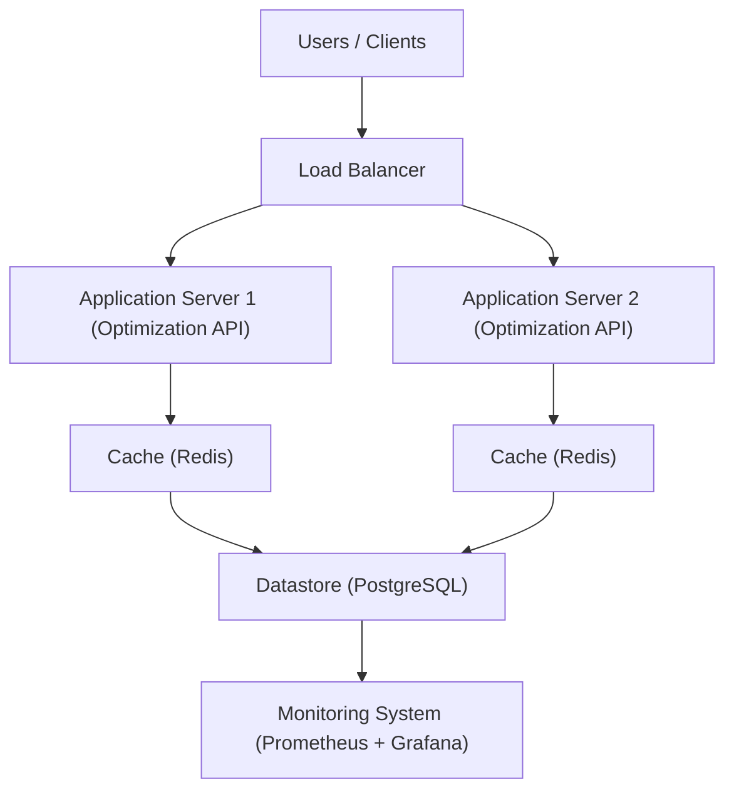

# Task 2: Concurrent System Design

### Goal:
Design a backend system that can serve the **Optimization API** under **heavy concurrent load**, ensuring:
- **Low latency** (fast response times),
- **Graceful degradation** (handle failures smoothly).

---

## 1. High-Level System Diagram

## 2. Key Components

| Component | Role |
|:----------|:-----|
| **Load Balancer** | Distributes user requests to available application servers. Performs health checks and reroutes traffic if a server fails. |
| **Application Servers** | Host the Optimization API. Stateless servers to allow easy scaling (adding/removing servers). |
| **Cache (Redis)** | Temporarily stores frequent optimization results and port constraint data to reduce database load and speed up responses. |
| **Database (PostgreSQL)** | Stores persistent data like port information, optimization results, and logs. |
| **Monitoring System (Prometheus + Grafana)** | Monitors the system's health, performance, and alerts when issues are detected. |

---

## 3. How the System Scales

- **Stateless Servers**:  
  Each application server does not store session data. This makes it easy to add more servers when load increases.

- **Caching**:  
  Frequently accessed optimization queries are cached in Redis to reduce recomputation and database hits.

- **Load Balancer**:  
  Can distribute traffic across many servers. New servers can be added automatically (horizontal scaling).

- **Database Scaling**:  
  Add read replicas to distribute database read load when needed.

---

## 4. How the System Handles Failures

- **Health Checks**:  
  The load balancer removes unhealthy servers from rotation automatically.

- **Graceful Degradation**:  
  If servers are overloaded, the system can serve cached approximate results instead of real-time computation.

- **Retry Logic**:  
  If an API request fails temporarily, it is retried automatically.

- **Monitoring and Alerting**:  
  Real-time monitoring with Prometheus + Grafana to detect performance issues early and alert the team.

---

# Summary

This system is:
- **Scalable** → Can handle increasing users by adding more servers.
- **Resilient** → Can recover from server failures without downtime.
- **Optimized** → Uses caching and load balancing to ensure fast responses.
- **Observable** → Issues are quickly detected through monitoring.

---

